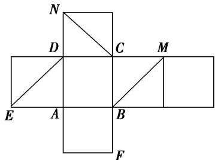

<!-- question-source:start -->
(1)如图是一个正方体的平面展开图．在这个正方体中，①BM 与 ED 是异面直线；②CN 与 BE 平行；③CN 与 BM 成 $60^{\circ}$ 角；④DM 与 BN 垂直.

以上四个命题中，正确命题的序号是\_\_\_\_。

<!-- question-source:end -->

![[高中/总复习/专题/立体几何/专题04 空间线面位置关系判定3/专题04_立体几何中空间线_面位置关系的判定_3_/例题/answers/Q00043519A1.md]]
