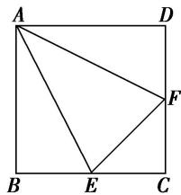

<!-- question-source:start -->
(3)如图，在正方形 ABCD 中，E, F 分别是 BC, CD 的中点，沿 AE, AF, EF 把正方形折成一个四面体，使 B, C, D 三点重合，重合后的点记为 P, P 点在 $\triangle AEF$ 内的射影为 O，则下列说法正确的是()

A. $O$ 是 $\triangle AEF$ 的垂心 B. $O$ 是 $\triangle AEF$ 的内心 C. $O$ 是 $\triangle AEF$ 的外心 D. $O$ 是 $\triangle AEF$ 的重心

<!-- question-source:end -->

![[高中/总复习/专题/立体几何/专题04 空间线面位置关系判定3/专题04_立体几何中空间线_面位置关系的判定_3_/例题/answers/Q00043521A1.md]]
