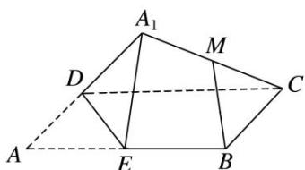

<!-- question-source:start -->
(5)如图, 在矩形 $ABCD$ 中, $AB = 2AD$ , $E$ 为边 $AB$ 的中点, 将 $\triangle ADE$ 沿直线 $DE$ 翻折成 $\triangle A_{1}DE$ . 若 $M$ 为线段 $A_{1}C$ 的中点, 则在 $\triangle ADE$ 翻折过程中, 下列四个命题中不正确的是 \_\_\_\_. (填序号)

①BM 是定值;

②点 M 在某个球面上运动;

③存在某个位置，使 $DE \perp A_{1}C;$

④存在某个位置，使 $MB \parallel$ 平面 $A_{1}DE$ .
<!-- question-source:end -->

![[高中/总复习/专题/立体几何/专题04 空间线面位置关系判定3/专题04_立体几何中空间线_面位置关系的判定_3_/例题/answers/Q00043523A1.md]]
