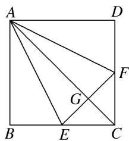
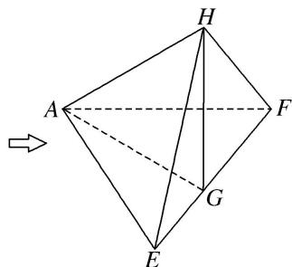

<!-- question-source:start -->
5. 如图，在正方形 ABCD 中，E, F 分别是 BC, CD 的中点，G 是 EF 的中点，现在沿 AE, AF 及 EF 把这个正方形折成一个空间图形，使 B, C, D 三点重合，重合后的点记为 H，那么，在这个空间图形中必有( )

A. $AG \perp$ 平面 $EFH$ B. $AH \perp$ 平面 $EFH$ C. $HF \perp$ 平面 $AEF$ D. $HG \perp$ 平面 $AEF$
<!-- question-source:end -->

![[高中/总复习/专题/立体几何/专题04 空间线面位置关系判定3/专题04_立体几何中空间线_面位置关系的判定_3_/对点训练/answers/Q00039564A1.md]]
