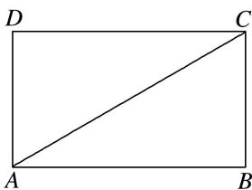

<!-- question-source:start -->
9. 在矩形 $ABCD$ 中, $AB = \sqrt{3}$ , $BC = 1$ , 将 $\triangle ABC$ 与 $\triangle ADC$ 沿 $AC$ 所在的直线进行随意翻折, 在翻折过程中直线 $AD$ 与直线 $BC$ 所成的角的范围(包含初始状态)为( )

A. $\left[0, \frac{\pi}{6}\right]$ B. $\left[0, \frac{\pi}{3}\right]$ C. $\left[0, \frac{\pi}{2}\right]$ D. $\left[0, \frac{2\pi}{3}\right]$
<!-- question-source:end -->

![[高中/总复习/专题/立体几何/专题04 空间线面位置关系判定3/专题04_立体几何中空间线_面位置关系的判定_3_/对点训练/answers/Q00039567A1.md]]
