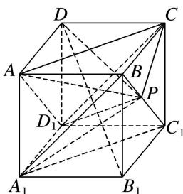

<!-- question-source:start -->
15. (多选)如图, 点 $P$ 在正方体 $ABCD - A_{1}B_{1}C_{1}D_{1}$ 的面对角线 $BC_{1}$ 上运动, 则下列四个结论正确的是( )

A. 三棱锥 $A - D_{1}PC$ 的体积不变 B. $A_{1}P \parallel$ 平面 $ACD_{1}$ C. $DP \perp BC_{1}$ D. 平面 $PDB_{1} \perp$ 平面 $ACD_{1}$ 15. 答案 ABD 解析 对于 A, 连接 $AD_{1}, CD_{1}, AC, D_{1}P$ , 如图, 由题意知 $AD_{1} \parallel BC_{1}, AD_{1} \subset$ 平面 $AD_{1}C$ , $BC_{1} \nsubseteq$ 平面 $AD_{1}C$ ,

从而 $BC_{1} //$ 平面 $AD_{1}C$ ，故 $BC_{1}$ 上任意一点到平面 $AD_{1}C$ 的距离均相等，所以以 $P$ 为顶点，平面 $AD_{1}C$ 为底面的三棱锥 $A - D_{1}PC$ 的体积不变，故 A 正确；对于 B，连接 $A_{1}B$ ， $A_{1}C_{1}$ ， $A_{1}P$ ，则 $A_{1}C_{1} // AC$ ，易知 $A_{1}C_{1} //$ 平面 $AD_{1}C$ ，由 A 知， $BC_{1} //$ 平面 $AD_{1}C$ ，又 $A_{1}C_{1} \cap BC_{1} = C_{1}$ ，所以平面 $BA_{1}C_{1} //$ 平面 $ACD_{1}$ ，又 $A_{1}P \subset$ 平面 $A_{1}C_{1}B$ ，所以 $A_{1}P //$ 平面 $ACD_{1}$ ，故 B 正确；对于 C，由于 $DC \perp$ 平面 $BCC_{1}B_{1}$ ，所以 $DC \perp BC_{1}$ ，若 $DP \perp BC_{1}$ ，则 $BC_{1} \perp$ 平面 $DCP$ ， $BC_{1} \perp PC$ ，则 $P$ 为中点，与 $P$ 为动点矛盾，故 C 错误；对于 D，连接 $DB_{1}$ ， $PD$ ，由 $DB_{1} \perp AC$ 且 $DB_{1} \perp AD_{1}$ ，可得 $DB_{1} \perp$ 平面 $ACD_{1}$ ，从而由面面垂直的判定定理知平面 $PDB_{1} \perp$ 平面 $ACD_{1}$ ，故 D 正确。
<!-- question-source:end -->
