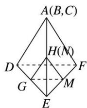

> [!faq]- 《专题04 空间线面位置关系判定3》例题解析
>
> > [!success]- **【答案】** 详见解析
>
> > [!note]- **【解析】**
> > 答案 ②③④ 解析 把正四面体的平面展开图还原，如图所示，GH 与 EF 为异面直线，BD 与 MN 为异面直线，GH 与 MN 成 $60^{\circ}$ 角， $DE \perp MN$ .
> >
> > 
