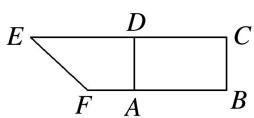
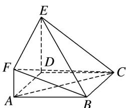
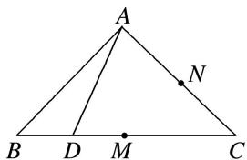
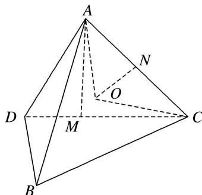

> [!faq]- 《专题04 空间线面位置关系判定3》例题解析
>
> > [!success]- **【答案】** C
>
> > [!note]- **【解析】**
> > 答案 C 解析 由题意，初始状态直线 AD 与直线 BC 所成的角为 0，当 $DB = \sqrt{2}$ 时， $AD \perp DB$ ， $AD \perp DC$ ，又 $DC \cap DB = D$ ，∴ $AD \perp$ 平面 DBC，又 $BC \subset$ 平面 DBC，所以 $AD \perp BC$ ，直线 AD 与直线 BC 所成的角为 $\frac{\pi}{2}$ ，∴ 在翻折过程中直线 AD 与直线 BC 所成角的范围（包含初始状态）为 $\left[0, \frac{\pi}{2}\right]$ .
> >
> > 10. 如图所示，在直角梯形 $BCEF$ 中， $\angle CBF = \angle BCE = 90^\circ$ ， $A, D$ 分别是 $BF$ ， $CE$ 上的点， $AD \parallel BC$ ，且 $AB = DE = 2BC = 2AF$ （如图1）。将四边形 $ADEF$ 沿 $AD$ 折起，连接 $AC, CF, BE, BF, CE$ （如图2），在折起的过程中，下列说法错误的是（）
> >
> > 
> >
> >   
> > 图1  
> > 图2
> >
> > A. $AC \parallel$ 平面 $BEF$ B. $B, C, E, F$ 四点不可能共面C. 若 $EF \perp CF$ , 则平面 $ADEF \perp$ 平面 $ABCD$ D. 平面 $BCE$ 与平面 $BEF$ 可能垂直
> >
> > 10. 答案 D 解析 A 选项, 连接 BD, 交 AC 于点 O, 取 BE 的中点 M, 连接 OM, FM, 则四边形 AOMF是平行四边形，所以 $AO \parallel FM$ ，因为 $FM \subset$ 平面 $BEF$ ， $AC \notin$ 平面 $BEF$ ，所以 $AC \parallel$ 平面 $BEF$ ；B选项，若 $B$ ， $C$ ， $E$ ， $F$ 四点共面，因为 $BC \parallel AD$ ，所以 $BC \parallel$ 平面 $ADEF$ ，又 $BC \subset$ 平面 $BCEF$ ，平面 $BCEF \cap$ 平面 $ADEF = EF$ ，所以可推出 $BC \parallel EF$ ，又 $BC \parallel AD$ ，所以 $AD \parallel EF$ ，矛盾；C选项，连接 $FD$ ，在平面 $ADEF$ 内，由勾股定理可得 $EF \perp FD$ ，又 $EF \perp CF$ ， $FD \cap CF = F$ ，所以 $EF \perp$ 平面 $CDF$ ，所以 $EF \perp CD$ ，又 $CD \perp AD$ ， $EF$ 与 $AD$ 相交，所以 $CD \perp$ 平面 $ADEF$ ，所以平面 $ADEF \perp$ 平面 $ABCD$ ；D选项，延长 $AF$ 至 $G$ ，使 $AF = FG$ ，连接 $BG$ ， $EG$ ，可得平面 $BCE \perp$ 平面 $ABF$ ，且平面 $BCE \cap$ 平面 $ABF = BG$ ，过 $F$ 作 $FN \perp BG$ 于 $N$ ，则 $FN \perp$ 平面 $BCE$ ，若平面 $BCE \perp$ 平面 $BEF$ ，则过 $F$ 作直线与平面 $BCE$ 垂直，其垂足在 $BE$ 上，矛盾.
> >
> > 11. 在等腰直角 $\triangle ABC$ 中, $AB \perp AC$ , $BC = 2$ , $M$ 为 $BC$ 的中点, $N$ 为 $AC$ 的中点, $D$ 为 $BC$ 边上一个动点, $\triangle ABD$ 沿 $AD$ 翻折使 $BD \perp DC$ , 点 $A$ 在平面 $BCD$ 上的投影为点 $O$ , 当点 $D$ 在 $BC$ 上运动时, 以下说法错误的是( )
> >
> > 
> >
> > A. 线段 $NO$ 为定长 B. $CO \in [1, \sqrt{2})$ C. $\angle AMO + \angle ADB > 180^{\circ}$ D. 点 $O$ 的轨迹是圆弧
> >
> > 11. 答案 C 解析 如图所示，对于 A， $\triangle AOC$ 为直角三角形， $ON$ 为斜边 $AC$ 上的中线， $ON = \frac{1}{2} AC$ 为定长，即 A 正确；对于 B， $D$ 在 $M$ 时， $AO = 1$ ， $CO = 1$ ， $\therefore CO \in [1, \sqrt{2})$ ，即 B 正确；对于 D，由 A 可知，点 $O$ 的轨迹是圆弧，即 D 正确，故选 C.
> >
> > 
