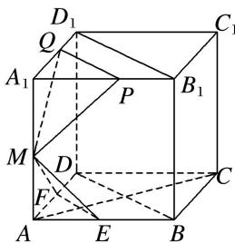

> [!faq]- 《专题04 空间线面位置关系判定3》例题解析
>
> > [!success]- **【答案】** 详见解析
>
> > [!note]- **【解析】**
> > 答案 ①②③ 解析 连接 BD, $B_{1}D_{1}$ , $\because A_{1}P=A_{1}Q=x$ ,
> >
> > 
> >
> > $\therefore PQ \parallel B_{1}D_{1} \parallel BD \parallel EF$ ，易证 $PQ \parallel$ 平面 $MEF$ ，又平面 $MEF \cap$ 平面 $MPQ = l$ ， $\therefore PQ \parallel l, l \parallel EF$ ， $\therefore l \parallel$ 平面 $ABCD$ ，故①成立；又 $EF \perp AC$ ， $\therefore l \perp AC$ ，故②成立； $\because l \parallel EF \parallel BD$ ， $\therefore$ 易知直线 $l$ 与平面 $BCC_{1}B_{1}$ 不垂直，故③成立；当 $x$ 变化时， $l$ 是过点 $M$ 且与直线 $EF$ 平行的定直线，故④不成立.
