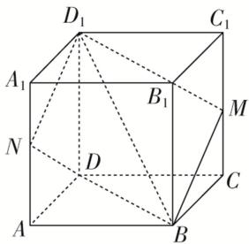
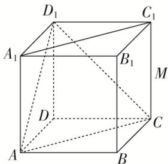
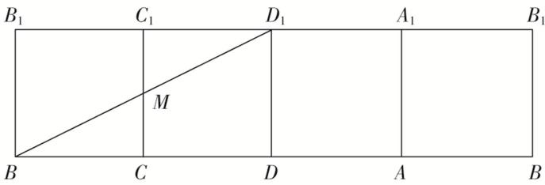

> [!faq]- 《专题04 空间线面位置关系判定3》例题解析
>
> > [!success]- **【答案】** ACD
>
> > [!note]- **【解析】**
> > 答案 ACD 解析 对于 A，因为平面 $ADD_{1}A_{1} \parallel$ 平面 $BCC_{1}B_{1}$ ， $BM \subset$ 平面 $BCC_{1}B_{1}$ ，即可判定直线 BM 与平面 $ADD_{1}A_{1}$ 平行，故正确；对于 B，如图 1，平面 $BMD_{1}$ 截正方体所得的截面为四边形，故错误；对于 C，如图 2，异面直线 $AD_{1}$ 与 $A_{1}C_{1}$ 所成的角为 $\angle D_{1}AC$ ，即可判定异面直线 $AD_{1}$ 与 $A_{1}C_{1}$ 所成的角为 $\frac{\pi}{3}$ ，故正确；对于 D，如图 3，将正方体的侧面展开，可得当 B，M， $D_{1}$ 共线时， $MB + MD_{1}$ 有最小值，最小值为 $BD_{1} = \sqrt{2^{2} + 1^{2}} = \sqrt{5}$ ，故正确．故选 ACD.
> >
> >   
> > 图1
> >
> >   
> > 图2
> >
> >   
> > 图3
