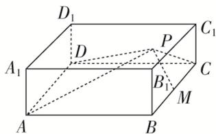

> [!faq]- 《专题04 空间线面位置关系判定3》例题解析
>
> > [!success]- **【答案】** B
>
> > [!note]- **【解析】**
> > 答案 A 解析 如图，由题意知，只需考虑点 P 在平面 $DCC_{1}D_{1}$ 上的情况，此时 $AD \perp DP, MC \perp CP$ ，所以 $\tan \angle APD = \frac{AD}{DP}, \tan \angle CPM = \frac{MC}{PC}$ 。因为 $\angle APD = \angle CPM$ ，所以 $\frac{AD}{DP} = \frac{MC}{PC}$ 。因为 M 是 BC 的中点，所以 AD = 2MC，所以 DP = 2PC。在平面 $D_{1}DCC_{1}$ 内，以 D 为原点，的方向为 x 轴的正方向， $DD_{1}$ 的方向为 y 轴的正方向，建立平面直角坐标系，则 $D(0, 0), C(6, 0)$ 。设 $P(x, y)$ ，则 $\sqrt{x^{2} + y^{2}} = 2\sqrt{(x - 6)^{2} + y^{2}}$ ，化简，得 $y^{2} + (x - 8)^{2} = 4^{2}$ 。该圆与平面 $D_{1}DCC_{1}$ 的交线长对应的圆心角为 $\frac{\pi}{6}$ ，则对应弧长为 $\frac{\pi}{6} \times 4 = \frac{2\pi}{3}$ 。
> >
> > 
