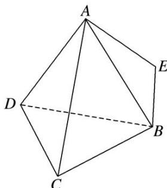

<!-- question-source:start -->
(6)等腰直角三角形 $ABE$ 的斜边 $AB$ 为正四面体 $ABCD$ 的侧棱, 直角边 $AE$ 绕斜边 $AB$ 旋转, 则在旋转的过程中, 有下列说法:

①四面体 E-BCD 的体积有最大值和最小值；

②存在某个位置，使得 $AE \perp BD;$

③设二面角 D-AB-E 的平面角为 $\theta$ ，则 $\theta \geq \angle DAE$ ;

④AE 的中点 M 与 AB 的中点 N 连线交平面 BCD 于点 P，则点 P 的轨迹为椭圆.
<!-- question-source:end -->

![[高中/总复习/专题/立体几何/专题04 立体几何中空间线、面位置关系的判定(3)-立体几何（文理通用）/专题04_立体几何中空间线_面位置关系的判定_3_/例题/answers/Q00043524A1.md]]
