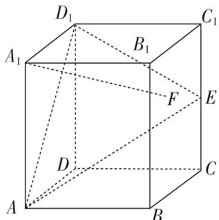

<!-- question-source:start -->
(7)在正方体 $ABCD-A_{1}B_{1}C_{1}D_{1}$ 中，E 是棱 $CC_{1}$ 的中点，F 是侧面 $BCC_{1}B_{1}$ 内的动点，且 $A_{1}F$ 与平面 $D_{1}AE$ 的垂线垂直，如图所示，下列说法不正确的是()

A. 点 $F$ 的轨迹是一条线段 B. $A_{1}F$ 与 $BE$ 是异面直线 C. $A_{1}F$ 与 $D_{1}E$ 不可能平行 D. 三棱锥 $F - ABC_{1}$ 的体积为定值
<!-- question-source:end -->

![[高中/总复习/专题/立体几何/专题04 立体几何中空间线、面位置关系的判定(3)-立体几何（文理通用）/专题04_立体几何中空间线_面位置关系的判定_3_/例题/answers/Q00043525A1.md]]
