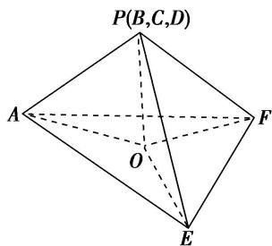

> [!faq]- 《专题04 立体几何中空间线、面位置关系的判定(3)-立体几何（文理通用）》例题解析
>
> > [!success]- **【答案】** A
>
> > [!note]- **【分析】**
> > 本题未单列分析。
>
> > [!note]- **【解析】**
> > 答案 A 解析 由题意可知 PA、PE、PF 两两垂直，所以 $PA \perp$ 平面 PEF，从而 $PA \perp EF$ ，而 $PO \perp$ 平面 AEF，则 $PO \perp EF$ ，因为 $PO \cap PA = P$ ，所以 $EF \perp$ 平面 PAO，∴ $EF \perp AO$ ，同理可知 $AE \perp FO$ ， $AF \perp EO$ ，∴ O 为 $\triangle AEF$ 的垂心．故选 A.
> >
> > 
