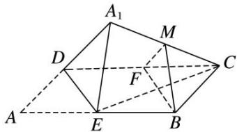

> [!faq]- 《专题04 立体几何中空间线、面位置关系的判定(3)-立体几何（文理通用）》例题解析
>
> > [!success]- **【答案】** 详见解析
>
> > [!note]- **【分析】**
> > 本题未单列分析。
>
> > [!note]- **【解析】**
> > 答案 ③ 解析 取 $DC$ 的中点 $F$ , 连接 $MF$ , $BF$ , 则 $MF \parallel A_{1}D$ 且 $MF = \frac{1}{2} A_{1}D$ , $FB \parallel ED$ 且 $FB = ED$ , 所以 $\angle MFB = \angle A_{1}DE$ . 由余弦定理可得 $MB^{2} = MF^{2} + FB^{2} - 2MF \cdot FB \cdot \cos \angle MFB$ 是定值, 所以 $M$ 是在以 $B$ 为球心, $MB$ 为半径的球上, 可得①②正确; 由 $MF \parallel A_{1}D$ 与 $FB \parallel ED$ 可得平面 $MBF \parallel$ 平面 $A_{1}DE$ , 可得④正确; 若存在某个位置, 使 $DE \perp A_{1}C$ , 则因为 $DE^{2} + CE^{2} = CD^{2}$ , 即 $CE \perp DE$ , 因为 $A_{1}C \cap CE = C$ , 则 $DE \perp$ 平面 $A_{1}CE$ , 所以 $DE \perp A_{1}E$ , 与 $DA_{1} \perp A_{1}E$ 矛盾, 故③不正确.
> >
> > 
