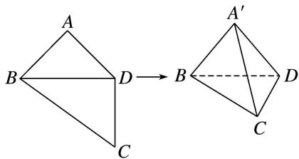

<!-- question-source:start -->
4. 如图，四边形 $ABCD$ 中， $AB = AD = CD = 1$ ， $BD = \sqrt{2}$ ， $BD \perp CD$ 。将四边形 $ABCD$ 沿对角线 $BD$ 拆成四面体 $A' - BCD$ ，使平面 $A'BD \perp$ 平面 $BCD$ ，则下列结论正确的是（）

A. $A^{\prime}C \perp BD$ B. $\angle BA^{\prime}C = 90^{\circ}$ C. $CA^{\prime}$ 与平面 $A^{\prime}BD$ 所成的角为 $30^{\circ}$ D. 四面体 $A^{\prime} - BCD$ 的体积为 $\frac{1}{3}$
<!-- question-source:end -->

![[高中/总复习/专题/立体几何/专题04 立体几何中空间线、面位置关系的判定(3)-立体几何（文理通用）/专题04_立体几何中空间线_面位置关系的判定_3_/对点训练/answers/Q00039563A1.md]]
