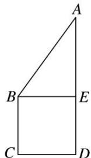

<!-- question-source:start -->
7. 如图所示, 正方形 $BCDE$ 的边长为 $a$ , 已知 $AB = \sqrt{3} BC$ , 将 $\triangle ABE$ 沿边 $BE$ 折起, 折起后 $A$ 点在平面 $BCDE$ 上的射影为 $D$ 点, 关于翻折后的几何体有如下描述: ① $AB$ 与 $DE$ 所成的角的正切值是 $\sqrt{2}$ ; ② $AB // CE$ ; ③ $V_{B-ACE} = \frac{a^3}{6}$ ; ④ 平面 $ABC \perp$ 平面 $ADC$ . 其中正确的有 \_\_\_\_. (填写你认为正确的序号)

<!-- question-source:end -->

![[高中/总复习/专题/立体几何/专题04 立体几何中空间线、面位置关系的判定(3)-立体几何（文理通用）/专题04_立体几何中空间线_面位置关系的判定_3_/对点训练/answers/Q00039566A1.md]]
