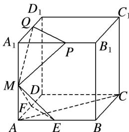

<!-- question-source:start -->
13. 如图，已知棱长为 1 的正方体 $ABCD - A_1B_1C_1D_1$ 中， $E, F, M$ 分别是线段 $AB, AD, AA_1$ 的中点，又 $P, Q$ 分别在线段 $A_1B_1, A_1D_1$ 上，且 $A_1P = A_1Q = x (0 < x < 1)$ .

设平面 $MEF \cap$ 平面 MPQ = l，现有下列结论：① $l \parallel$ 平面 ABCD；② $l \perp AC$ ；③ 直线 l 与平面 $BCC_{1}B_{1}$ 不垂直；④ 当 x 变化时，l 不是定直线.

其中成立的结论是\_\_\_\_．(写出所有成立结论的序号)
<!-- question-source:end -->

![[高中/总复习/专题/立体几何/专题04 立体几何中空间线、面位置关系的判定(3)-立体几何（文理通用）/专题04_立体几何中空间线_面位置关系的判定_3_/对点训练/answers/Q00039569A1.md]]
