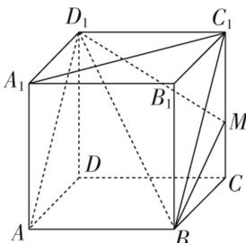

<!-- question-source:start -->
14. (多选)在棱长为 1 的正方体 $ABCD - A_{1}B_{1}C_{1}D_{1}$ 中，点 $M$ 在棱 $CC_{1}$ 上，则下列结论正确的是( )

A. 直线 $BM$ 与平面 $ADD_{1}A_{1}$ 平行 B. 平面 $BMD_{1}$ 截正方体所得的截面为三角形 C. 异面直线 $AD_{1}$ 与 $A_{1}C_{1}$ 所成的角为 $\frac{\pi}{3}$ D. $MB + MD_{1}$ 的最小值为 $\sqrt{5}$
<!-- question-source:end -->

![[高中/总复习/专题/立体几何/专题04 立体几何中空间线、面位置关系的判定(3)-立体几何（文理通用）/专题04_立体几何中空间线_面位置关系的判定_3_/对点训练/answers/Q00039570A1.md]]
