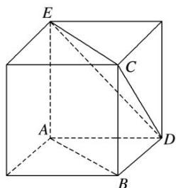

> [!faq]- 《专题04 立体几何中空间线、面位置关系的判定(3)-立体几何（文理通用）》例题解析
>
> > [!success]- **【答案】** D
>
> > [!note]- **【分析】**
> > 本题未单列分析。
>
> > [!note]- **【解析】**
> > 答案 D 解析 如图，直线 $AB$ ， $CD$ 异面．因为 $CE \parallel AB$ ，所以 $\angle ECD$ 即为异面直线 $AB$ ， $CD$ 所成的角，因为 $\triangle CDE$ 为等边三角形，故 $\angle ECD = 60^\circ$ ．
> > 
