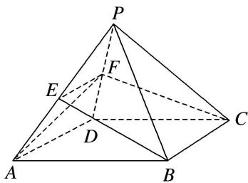

> [!faq]- 《专题04 立体几何中空间线、面位置关系的判定(3)-立体几何（文理通用）》例题解析
>
> > [!success]- **【答案】** B
>
> > [!note]- **【分析】**
> > 本题未单列分析。
>
> > [!note]- **【解析】**
> > 答案 B 解析 将展开图还原为几何体(如图)，因为 E，F 分别为 PA，PD 的中点，所以 $EF \parallel AD \parallel BC$ ，即直线 BE 与 CF 共面，①错；因为 $B \notin$ 平面 PAD， $E \in$ 平面 PAD， $E \notin AF$ ，所以 BE 与 AF 是异面直线，②正确；因为 $EF \parallel AD \parallel BC$ ， $EF \notin$ 平面 PBC， $BC \subset$ 平面 PBC，所以 $EF \parallel$ 平面 PBC，③正确；平面 PAD 与平面 BCE 不一定垂直，④错．故选 B.
> >
> > 
