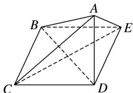
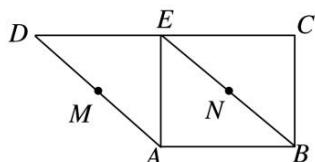
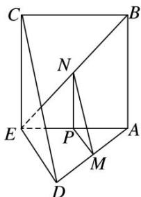

> [!faq]- 《专题04 立体几何中空间线、面位置关系的判定(3)-立体几何（文理通用）》例题解析
>
> > [!success]- **【答案】** 详见解析
>
> > [!note]- **【分析】**
> > 本题未单列分析。
>
> > [!note]- **【解析】**
> > 答案 ①③④ 解析 作出折叠后的几何体直观图如图所示.
> > 
> > ∵ A 点在平面 BCDE 上的射影为点 D，∴ $AD \perp$ 平面 BCDE。∵ $BC \subset$ 平面 BCDE，∴ $AD \perp BC$ 。∵ 四边形 BCDE 是正方形，∴ $BC \perp CD$ ，又 $AD \cap CD = D$ ，AD， $CD \subset$ 平面 ACD，∴ BC ⊥ 平面 ADC。又 BC ⊂ 平面 ABC，∴ 平面 ABC ⊥ 平面 ADC，故④正确；∵ DE // BC，∴ ∠ABC 或其补角为 AB 与 DE 所成的角，∵ BC ⊥ 平面 ADC，AC ⊂ 平面 ADC，∴ BC ⊥ AC，∵ $AB = \sqrt{3}BC$ ，BC = a，∴ 在 Rt△ABC 中， $AC = \sqrt{AB^{2} - BC^{2}} = \sqrt{2}a$ ，∴ $\tan \angle ABC = \frac{AC}{BC} = \sqrt{2}$ ，故①正确；连接 BD，CE，则 CE ⊥ BD，又 AD ⊥ 平面 BCDE，CE ⊂ 平面 BCDE，∴ CE ⊥ AD。又 $BD \cap AD = D$ ，BD，AD ⊂ 平面 ABD，∴ CE ⊥ 平面 ABD，又 AB ⊂ 平面 ABD，∴ CE ⊥ AB。故②错误；在 Rt△ABE 中， $AB = \sqrt{3}a$ ，BE = a，∴ AE = $\sqrt{2}a$ ，又 DE = a，AD ⊥ DE，∴ AD = a，∴ 三棱锥 B-ACE 的体积 $V_{B-ACE} = V_{A-BCE} = \frac{1}{3}S_{\triangle BCE} \cdot AD = \frac{1}{3} \times \frac{1}{2} \times a^{2} \times a = \frac{a^{3}}{6}$ ，故③正确。
> > 8. 如图, 在直角梯形 $ABCD$ 中, $BC \perp DC$ , $AE \perp DC$ , 且 $E$ 为 $CD$ 的中点, $M$ , $N$ 分别是 $AD$ , $BE$ 的中点, 将 $\triangle ADE$ 沿 $AE$ 折起, 则下列说法正确的是 \_\_\_\_. (写出所有正确说法的序号)
> > 
> > - **①**：不论 D 折至何位置(不在平面 ABC 内)，都有 $MN \parallel$ 平面 DEC;
> > - **②**：不论 D 折至何位置(不在平面 ABC 内)，都有 $MN \perp AE$ ;
> > - **③**：不论 D 折至何位置(不在平面 ABC 内)，都有 $MN \parallel AB$ ;
> > - **④**：在折起过程中，一定存在某个位置，使 $EC \perp AD$ .
> > 8. 答案 ①②④ 解析 由已知，在未折叠的原梯形中， $AB \parallel DE$ ， $BE \parallel AD$ ，所以四边形ABED为平行四边形，所以BE=AD，折叠后如图所示。
> > - **①**：过点M作 $MP \parallel DE$ ，交AE于点P，连接NP。因为M，N分别是AD，BE的中点，所以点P为AE的中点，故 $NP \parallel EC$ 。又 $MP \cap NP = P$ ， $DE \cap CE = E$ ，所以平面 $MNP \parallel$ 平面DEC，故 $MN \parallel$ 平面DEC，①正确；
> > - **②**：由已知， $AE \perp ED$ ， $AE \perp EC$ ，所以 $AE \perp MP$ ， $AE \perp NP$ ，又 $MP \cap NP = P$ ，所以 $AE \perp$ 平面MNP，又 $MN \subset$ 平面MNP，所以 $MN \perp AE$ ，②正确；
> > - **③**：假设 $MN \parallel AB$ ，则MN与AB确定平面MNBA，从而 $BE \subset$ 平面MNBA， $AD \subset$ 平面MNBA，与BE和AD是异面直线矛盾，③错误；
> > - **④**：当 $EC \perp ED$ 时， $EC \perp AD$ 。因为 $EC \perp EA$ ， $EC \perp ED$ ， $EA \cap ED = E$ ，所以 $EC \perp$ 平面AED， $AD \subset$ 平面AED，所以 $EC \perp AD$ ，④正确。
> > 
