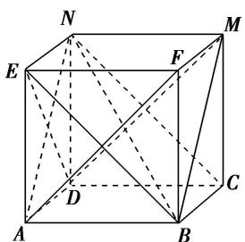
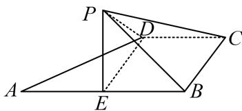

> [!faq]- 《专题04 立体几何中空间线、面位置关系的判定(3)-立体几何（文理通用）》例题解析
>
> > [!success]- **【答案】** C
>
> > [!note]- **【分析】**
> > 本题未单列分析。
>
> > [!note]- **【解析】**
> > 答案 ①②③④ 解析 由题意画出该正方体的图形如图所示，连接 BE，BN，显然①②正确；
> > - **对于③**：，连接 AN，易得 $AN \parallel BM$ ， $\angle ANC = 60^{\circ}$ ，所以 CN 与 BM 成 $60^{\circ}$ 角，所以③正确；
> > - **对于④**：，易知 $DM \perp$ 平面 BCN，所以 $DM \perp BN$ 正确.
> > 
> > (2)已知四边形ABCD是矩形， $AB = 4$ ， $AD = 3$ 。沿AC将 $\triangle ADC$ 折起到 $\triangle AD'C$ ，使平面 $AD'C\perp$ 平面ABC， $F$ 是 $AD^{\prime}$ 的中点， $E$ 是 $AC$ 上一点，给出下列结论：
> > - **①**：存在点 E，使得 $EF \parallel$ 平面 $BCD'$ ;
> > - **②**：存在点 E，使得 $EF \perp$ 平面 ABC;
> > - **③**：存在点 E，使得 $D'E \perp$ 平面 ABC；
> > - **④**：存在点 E，使得 $AC \perp$ 平面 $BD'E$ .
> > 其中正确的结论是\_\_\_\_(写出所有正确结论的序号).
> > 答案 ①②③ 解析 对于①，存在 $AC$ 的中点 $E$ ，使得 $EF \parallel CD'$ ，利用线面平行的判定定理可得 $EF \parallel$ 平面 $BCD'$ ；
> > - **对于②**：，过点 $F$ 作 $EF \perp AC$ ，垂足为 $E$ ，利用面面垂直的性质定理可得 $EF \perp$ 平面 $ABC$ ；
> > - **对于③**：，过点 $D'$ 作 $D'E \perp AC$ ，垂足为 $E$ ，利用面面垂直的性质定理可得 $D'E \perp$ 平面 $ABC$ ；
> > - **对于④**：，因为 $ABCD$ 是矩形， $AB = 4, AD = 3$ ，所以 $B, D'$ 在 $AC$ 上的射影不是同一点，所以不存在点 $E$ ，使得 $AC \perp$ 平面 $BD'E$ .
> > (3)如图，在正方形 ABCD 中，E, F 分别是 BC, CD 的中点，沿 AE, AF, EF 把正方形折成一个四面体，使 B, C, D 三点重合，重合后的点记为 P, P 点在 $\triangle AEF$ 内的射影为 O，则下列说法正确的是()
> > A. $O$ 是 $\triangle AEF$ 的垂心 B. $O$ 是 $\triangle AEF$ 的内心 C. $O$ 是 $\triangle AEF$ 的外心 D. $O$ 是 $\triangle AEF$ 的重心
> > 
> > 答案 A 解析 由题意可知 PA、PE、PF 两两垂直，所以 $PA \perp$ 平面 PEF，从而 $PA \perp EF$ ，而 $PO \perp$ 平面 AEF，则 $PO \perp EF$ ，因为 $PO \cap PA = P$ ，所以 $EF \perp$ 平面 PAO，∴ $EF \perp AO$ ，同理可知 $AE \perp FO$ ， $AF \perp EO$ ，∴ O 为 $\triangle AEF$ 的垂心．故选 A.
> > 
> > (4)(多选)如图，在直角梯形 ABCD 中， $AB \parallel CD$ ， $AB \perp BC$ ， $BC = CD = \frac{1}{2} AB = 2$ ，E 为 AB 的中点，以 DE 为折痕把 $\triangle ADE$ 折起，使点 A 到达点 P 的位置，且 $PC = 2\sqrt{3}$ 。则()
> > 
> > A. 平面 $PED \perp$ 平面 $EBCD$ B. $PC \perp ED$ C. 二面角 $P - DC - B$ 的大小为 $45^{\circ}$ D. $PC$ 与平面 $PED$ 所成角的正切值为 $\sqrt{2}$
> > 答案 AC 解析 A 项, $PD = AD = \sqrt{AE^2 + DE^2} = \sqrt{2^2 + 2^2} = 2\sqrt{2}$ , 在三角形 PDC 中, $PD^2 + CD^2 = PC^2$ , 所以 $PD \perp CD$ , 又 $CD \perp DE$ , 可得 $CD \perp$ 平面 PED, $CD \subset$ 平面 EBCD, 所以平面 PED $\perp$ 平面 EBCD, 正确; B 项, 若 $PC \perp ED$ , 又 $ED \perp CD$ , 可得 $ED \perp$ 平面 PDC, 则 $ED \perp PD$ , 而 $\angle EDP = \angle EDA = 45^\circ$ , 显然矛盾, 故错误; C 项, 二面角 $P - DC - B$ 的平面角为 $\angle PDE$ , 又 $\angle PDE = \angle ADE = 45^\circ$ , 故正确; D 项, 由上面分析可知, $\angle CPD$ 为直线 PC 与平面 PED 所成的角, 在 Rt $\triangle PCD$ 中, $\tan \angle CPD = \frac{CD}{PD} = \frac{\sqrt{2}}{2}$ , 故错误. 故选 AC.
> > (5)如图, 在矩形 $ABCD$ 中, $AB = 2AD$ , $E$ 为边 $AB$ 的中点, 将 $\triangle ADE$ 沿直线 $DE$ 翻折成 $\triangle A_{1}DE$ . 若 $M$ 为线段 $A_{1}C$ 的中点, 则在 $\triangle ADE$ 翻折过程中, 下列四个命题中不正确的是 \_\_\_\_. (填序号)
> > 
> > - **①**：BM 是定值;
> > - **②**：点 M 在某个球面上运动;
> > - **③**：存在某个位置，使 $DE \perp A_{1}C;$
> > - **④**：存在某个位置，使 $MB \parallel$ 平面 $A_{1}DE$ .
> > 答案 ③ 解析 取 $DC$ 的中点 $F$ , 连接 $MF$ , $BF$ , 则 $MF \parallel A_{1}D$ 且 $MF = \frac{1}{2} A_{1}D$ , $FB \parallel ED$ 且 $FB = ED$ , 所以 $\angle MFB = \angle A_{1}DE$ . 由余弦定理可得 $MB^{2} = MF^{2} + FB^{2} - 2MF \cdot FB \cdot \cos \angle MFB$ 是定值, 所以 $M$ 是在以 $B$ 为球心, $MB$ 为半径的球上, 可得①②正确; 由 $MF \parallel A_{1}D$ 与 $FB \parallel ED$ 可得平面 $MBF \parallel$ 平面 $A_{1}DE$ , 可得④正确; 若存在某个位置, 使 $DE \perp A_{1}C$ , 则因为 $DE^{2} + CE^{2} = CD^{2}$ , 即 $CE \perp DE$ , 因为 $A_{1}C \cap CE = C$ , 则 $DE \perp$ 平面 $A_{1}CE$ , 所以 $DE \perp A_{1}E$ , 与 $DA_{1} \perp A_{1}E$ 矛盾, 故③不正确.
> > 
> > (6)等腰直角三角形 $ABE$ 的斜边 $AB$ 为正四面体 $ABCD$ 的侧棱, 直角边 $AE$ 绕斜边 $AB$ 旋转, 则在旋转的过程中, 有下列说法:
> > 
> > - **①**：四面体 E-BCD 的体积有最大值和最小值；
> > - **②**：存在某个位置，使得 $AE \perp BD;$
> > - **③**：设二面角 D-AB-E 的平面角为 $\theta$ ，则 $\theta \geq \angle DAE$ ;
> > - **④**：AE 的中点 M 与 AB 的中点 N 连线交平面 BCD 于点 P，则点 P 的轨迹为椭圆.
> > 答案 D 解析 根据正四面体的特征，以及等腰直角三角形的特征，可以得到当直角边 AE 绕斜边 AB 旋转的过程中，存在着最高点和最低点，并且最低点在底面的上方，所以四面体 E-BCD 的体积有最大值和最小值，故①正确；要想使 $AE \perp BD$ ，就要使 AE 落在竖直方向的平面内，而转到这个位置的时候，使得 $AE \perp BD$ ，且满足是等腰直角三角形，所以②正确；利用二面角的平面角的定义，找到其平面角，设二面角 D-AB-E 的平面角为 $\theta$ ，则 $\theta \geq \angle DAE$ ，所以③是正确的；根据平面截圆锥所得的截面可以断定，AE 的中点 M 与 AB 的中点 N 连线交平面 BCD 于点 P，则点 P 的轨迹为椭圆，所以④正确。故正确的命题的个数是 4，故选 D.
> > (7)在正方体 $ABCD-A_{1}B_{1}C_{1}D_{1}$ 中，E 是棱 $CC_{1}$ 的中点，F 是侧面 $BCC_{1}B_{1}$ 内的动点，且 $A_{1}F$ 与平面 $D_{1}AE$ 的垂线垂直，如图所示，下列说法不正确的是()
> > 
> > A. 点 $F$ 的轨迹是一条线段 B. $A_{1}F$ 与 $BE$ 是异面直线 C. $A_{1}F$ 与 $D_{1}E$ 不可能平行 D. 三棱锥 $F - ABC_{1}$ 的体积为定值
> > 答案 C 解析 由题知 $A_{1}F \parallel$ 平面 $D_{1}AE$ ，分别取 $B_{1}C_{1}$ ， $BB_{1}$ 的中点 $H$ ， $G$ ，连接 $HG$ ， $A_{1}H$ ， $A_{1}G$ ， $BC_{1}$ ，可得 $HG \parallel BC_{1} \parallel AD_{1}$ ， $A_{1}G \parallel D_{1}E$ ，故平面 $A_{1}HG \parallel$ 平面 $AD_{1}E$ ，故点 $F$ 的轨迹为线段 $HG$ ，A 正确；由异面直线的判定定理可知 $A_{1}F$ 与 $BE$ 是异面直线，故 B 正确；当 $F$ 是 $BB_{1}$ 的中点时， $A_{1}F$ 与 $D_{1}E$ 平行，故 C 不正确； $\because HG \parallel$ 平面 $ABC_{1}$ ， $\therefore F$ 点到平面 $ABC_{1}$ 的距离不变，故三棱锥 $F-ABC_{1}$ 的体积为定值，故 D 正确.
> > (8)在正方体 $ABCD-A_{1}B_{1}C_{1}D_{1}$ 中，已知点 P 在直线 $BC_{1}$ 上运动，则下列四个命题：
> > - **①**：三棱锥 $A-D_{1}PC$ 的体积不变;
> > - **②**：直线 AP 与平面 $ACD_{1}$ 所成的角的大小不变;
> > - **③**：二面角 $P-AD_{1}-C$ 的大小不变;
> > - **④**：若 M 是平面 $A_{1}B_{1}C_{1}D_{1}$ 上到点 D 和 $C_{1}$ 距离相等的点，则 M 点的轨迹是直线 $A_{1}D_{1}$ .
> > 其中真命题的序号是\_\_\_\_。
> > 答案 ①③④ 解析 ① $V_{A-D_{1}PC}=V_{C-AD_{1}P}=\frac{1}{3}\times\frac{B_{1}C}{2}\times\frac{1}{2}S_{\square AD_{1}C_{1}B}$ 为定值；
> > - **②**：因为 $BC_{1}//AD_{1}$ ，所以 $BC_{1}//$ 平面 $AD_{1}C$ ，因此 P 到平面 $AD_{1}C$ 的距离不变，但 AP 长度变化，因此直线 AP 与平面 $ACD_{1}$ 所成的角的大小变化；
> > - **③**：二面角 $P-AD_{1}-C$ 的大小就是平面 $ABC_{1}D_{1}$ 与平面 $AD_{1}C$ 所成二面角的大小，因此不变；
> > - **④**：到点 D 和 $C_{1}$ 距离相等的点在平面 $A_{1}BCD_{1}$ 上，所以 M 点的轨迹是平面 $A_{1}BCD_{1}$ 与平面 $A_{1}B_{1}C_{1}D_{1}$ 的交线 $A_{1}D_{1}$ 。综上，真命题的序号是①③④。
> > ## 【对点精练】
