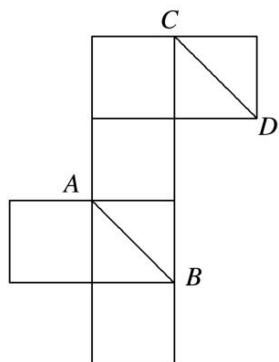

<!-- question-source:start -->
1. 将正方体的纸盒展开如图，直线 $AB$ ， $CD$ 在原正方体的位置关系是( )

A. 平行 B. 垂直 C. 相交成 $60^{\circ}$ 角 D. 异面且成 $60^{\circ}$ 角
<!-- question-source:end -->

![[高中/总复习/专题/立体几何/专题04 立体几何中空间线、面位置关系的判定(3)-立体几何（文理通用）/专题04_立体几何中空间线_面位置关系的判定_3__立体几何_文理通用_/对点训练/answers/Q00039560A1.md]]
