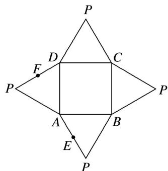

<!-- question-source:start -->
3. 如图是一几何体的平面展开图, 其中四边形 $ABCD$ 为正方形, $E$ , $F$ 分别为 $PA$ , $PD$ 的中点, 在此几何体中, 给出下面 4 个结论:

①直线 BE 与直线 CF 异面；②直线 BE 与直线 AF 异面；③直线 EF // 平面 PBC；④平面 BCE ⊥ 平面 PAD．其中正确的有( )

A. 1 个

B. 2 个

C. 3 个

D. 4 个
<!-- question-source:end -->

![[高中/总复习/专题/立体几何/专题04 立体几何中空间线、面位置关系的判定(3)-立体几何（文理通用）/专题04_立体几何中空间线_面位置关系的判定_3__立体几何_文理通用_/对点训练/answers/Q00039562A1.md]]
