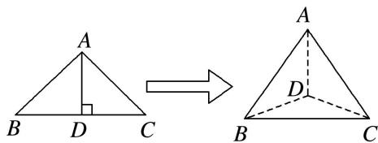

<!-- question-source:start -->
6. (多选)如图, 以等腰直角三角形 $ABC$ 的斜边 $BC$ 上的高 $AD$ 为折痕, 翻折 $\triangle ABD$ 和 $\triangle ACD$ , 使得平面 $ABD \perp$ 平面 $ACD$ . 下列结论正确的是( )

A. $BD \perp AC$ B. $\triangle BAC$ 是等边三角形

C. 三棱锥 $D - ABC$ 是正三棱锥 D. 平面 $ADC \perp$ 平面 $ABC$
<!-- question-source:end -->

![[高中/总复习/专题/立体几何/专题04 立体几何中空间线、面位置关系的判定(3)-立体几何（文理通用）/专题04_立体几何中空间线_面位置关系的判定_3__立体几何_文理通用_/对点训练/answers/Q00039565A1.md]]
