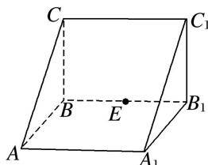

<!-- question-source:start -->
12. 如图，在直三棱柱 $ABC - A_{1}B_{1}C_{1}$ 中， $AA_{1} = 2$ ， $AB = BC = 1$ ， $\angle ABC = 90^{\circ}$ ，外接球的球心为 $O$ ，点 $E$ 是侧棱 $BB_{1}$ 上的一个动点。有下列判断：

①直线 AC 与直线 $C_{1}E$ 是异面直线；② $A_{1}E$ 一定不垂直于 $AC_{1}$ ；③三棱锥 $E—AA_{1}O$ 的体积为定值；④ $AE+EC_{1}$ 的最小值为 $2\sqrt{2}$ .
其中正确的个数是( )
A. 1 B. 2 C. 3 D. 4
<!-- question-source:end -->

![[高中/总复习/专题/立体几何/专题04 立体几何中空间线、面位置关系的判定(3)-立体几何（文理通用）/专题04_立体几何中空间线_面位置关系的判定_3__立体几何_文理通用_/对点训练/answers/Q00039568A1.md]]
