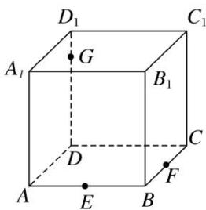

<!-- question-source:start -->
(1)如图，在正方体 $ABCD-A_{1}B_{1}C_{1}D_{1}$ 中，E, F, G 分别在 AB, BC, $DD_{1}$ 上，则作过 E, F, G 三点的截面图形为()

A. 四边形 B. 三角形 C. 五边形 D. 六边形
<!-- question-source:end -->

![[高中/总复习/专题/立体几何/专题05 立体几何中的截面问题-立体几何（文理通用）/专题05_立体几何中的截面问题/例题/answers/Q00043527A1.md]]
