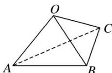

<!-- question-source:start -->
(4)如图, 在三棱锥 $O-ABC$ 中, 三条棱 $OA$ , $OB$ , $OC$ 两两垂直, 且 $OA>OB>OC$ , 分别经过三条棱 $OA$ , $OB$ , $OC$ 作一个截面平分三棱锥的体积, 截面面积依次为 $S_1$ , $S_2$ , $S_3$ , 则 $S_1$ , $S_2$ , $S_3$ 的大小关系为 \_\_\_\_.

<!-- question-source:end -->

![[高中/总复习/专题/立体几何/专题05 立体几何中的截面问题-立体几何（文理通用）/专题05_立体几何中的截面问题/例题/answers/Q00043530A1.md]]
