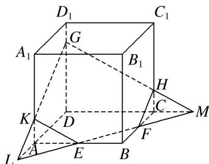

> [!faq]- 《专题05 立体几何中的截面问题-立体几何（文理通用）》例题解析
>
> > [!success]- **【答案】** C
>
> > [!note]- **【分析】**
> > 本题未单列分析。
>
> > [!note]- **【解析】**
> > 答案 C 解析 作法: ①在底面 $AC$ 内, 过 $E$ , $F$ 作直线 $EF$ , 分别与 $DA$ , $DC$ 的延长线交于 $L$ , $M$ . ②在侧面 $A_{1}D$ 内, 连接 $LG$ 交 $AA_{1}$ 于 $K$ . ③在侧面 $D_{1}C$ 内, 连接 $GM$ 交 $CC_{1}$ 于 $H$ . ④连接 $KE$ , $FH$ . 则五边形 $EFHGK$ 即为所求的截面.
> >
> > 
