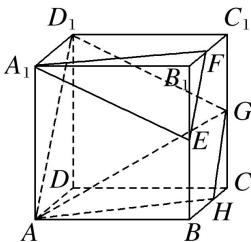

> [!faq]- 《专题05 立体几何中的截面问题-立体几何（文理通用）》例题解析
>
> > [!success]- **【答案】** D
>
> > [!note]- **【分析】**
> > 本题未单列分析。
>
> > [!note]- **【解析】**
> > 答案 D 解析 取 BC 的中点 H，连接 AH，GH， $AD_{1}$ ， $D_{1}G$ ，
> > 
> > 由题意得 $GH \parallel EF$ , $AH \parallel A_1F$ , 又 $GH \nsubseteq$ 平面 $A_1EF$ , $EF \subset$ 平面 $A_1EF$ , $\therefore GH \parallel$ 平面 $A_1EF$ , 同理 $AH \parallel$ 平面 $A_1EF$ , 又 $GH \cap AH = H$ , $GH$ , $AH \subset$ 平面 $AHGD_1$ , $\therefore$ 平面 $AHGD_1 \parallel$ 平面 $A_1EF$ , 故过线段 $AG$ 且与平面 $A_1EF$ 平行的截面图形为四边形 $AHGD_1$ , 显然为等腰梯形.
