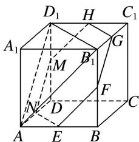

> [!faq]- 《专题05 立体几何中的截面问题-立体几何（文理通用）》例题解析
>
> > [!success]- **【答案】** A
>
> > [!note]- **【解析】**
> > 答案 A 解析 如图所示，在正方体 $ABCD-A_{1}B_{1}C_{1}D_{1}$ 中，平面 $AB_{1}D_{1}$ 与棱 $A_{1}A, A_{1}B_{1}, A_{1}D_{1}$ 所成的角都相等，又正方体的其余棱都分别与 $A_{1}A, A_{1}B_{1}, A_{1}D_{1}$ 平行，故正方体 $ABCD-A_{1}B_{1}C_{1}D_{1}$ 的每条棱所在直线与平面 $AB_{1}D_{1}$ 所成的角都相等．取棱 AB, $BB_{1}, B_{1}C_{1}, C_{1}D_{1}, DD_{1}, AD$ 的中点 E, F, G, H, M, N，则正六边形 EFGHMN 所在平面与平面 $AB_{1}D_{1}$ 平行且面积最大，此截面面积为 $S_{正六边形 EFGHMN}=6\times\frac{1}{2}\times\frac{\sqrt{2}}{2}\times\frac{\sqrt{2}}{2}\sin60^{\circ}=\frac{3\sqrt{3}}{4}$ . 故选 A.
> >
> > 
