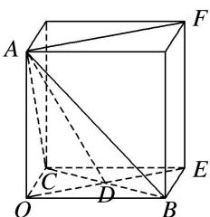

> [!faq]- 《专题05 立体几何中的截面问题-立体几何（文理通用）》例题解析
>
> > [!success]- **【答案】** 详见解析
>
> > [!note]- **【分析】**
> > 本题未单列分析。
>
> > [!note]- **【解析】**
> > 答案 $S_{3} < S_{2} < S_{1}$ 解析 由题意知 $OA, OB, OC$ 两两垂直，可将其放置在以 $O$ 为顶点的长方体中，设三边 $OA, OB, OC$ 分别为 $a, b, c$ ，且 $a > b > c$ ，利用等体积法易得
> >
> > 
> >
> > $$
> > S _ {1} = \frac {1}{4} a \sqrt {b ^ {2} + c ^ {2}}, S _ {2} = \frac {1}{4} b \sqrt {a ^ {2} + c ^ {2}}, S _ {3} = \frac {1}{4} c \sqrt {a ^ {2} + b ^ {2}}, \therefore S _ {1} ^ {2} - S _ {2} ^ {2} = \frac {1}{1 6} (a ^ {2} b ^ {2} + a ^ {2} c ^ {2}) - \frac {1}{1 6} (b ^ {2} a ^ {2} + b ^ {2} c ^ {2}) = \frac {1}{1 6} c ^ {2} (a ^ {2} -
> > $$
> >
> > $b^{2}$ ，又 a > b，∴ $S_{1}^{2} - S_{2}^{2} > 0$ ，即 $S_{1} > S_{2}$ ，同理，平方后作差可得， $S_{2} > S_{3}$ ，∴ $S_{3} < S_{2} < S_{1}$ .
