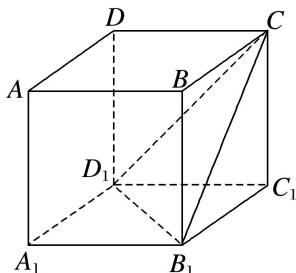

> [!faq]- 《专题05 立体几何中的截面问题-立体几何（文理通用）》例题解析
>
> > [!success]- **【答案】** A
>
> > [!note]- **【解析】**
> > 答案 A 解析 如图所示，设平面 $CB_{1}D_{1} \cap$ 平面 ABCD = m₁，∵ $\alpha \parallel$ 平面 $CB_{1}D_{1}$ ，则 $m_{1} \parallel m$ ，
> >
> > 
> >
> > 又∵平面 $ABCD \parallel$ 平面 $A_{1}B_{1}C_{1}D_{1}$ ，平面 $CB_{1}D_{1} \cap$ 平面 $A_{1}B_{1}C_{1}D_{1} = B_{1}D_{1}$ ，∴ $B_{1}D_{1} \parallel m_{1}$ ，∴ $B_{1}D_{1} \parallel m$ ，同理可得 $CD_{1} \parallel n$ 。故 m，n 所成角的大小与 $B_{1}D_{1}$ ， $CD_{1}$ 所成角的大小相等，即 $\angle CD_{1}B_{1}$ 的大小。而 $B_{1}C = B_{1}D_{1} = CD_{1}$ （均为面对角线），因此 $\angle CD_{1}B_{1} = \frac{\pi}{3}$ ，得 $\sin \angle CD_{1}B_{1} = \frac{\sqrt{3}}{2}$ ，故选 A。
> >
> > 【对点精练】
