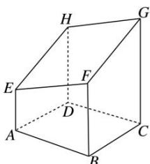

<!-- question-source:start -->
1. 如图是长方体被一平面所截得的几何体, 四边形 $EFGH$ 为截面, 则四边形 $EFGH$ 的图形为( )

A. 矩形 B. 平行四边形 C. 正方形 D. 等腰梯形
<!-- question-source:end -->

![[高中/总复习/专题/立体几何/专题05 立体几何中的截面问题-立体几何（文理通用）/专题05_立体几何中的截面问题/对点训练/answers/Q00039574A1.md]]
