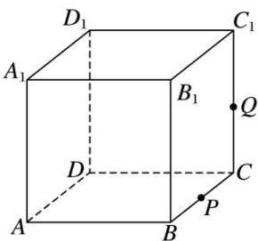

<!-- question-source:start -->
3. (多选)如图, 正方体 $ABCD - A_{1}B_{1}C_{1}D_{1}$ 的棱长为 1 , $P$ 为 $BC$ 的中点, $Q$ 为线段 $CC_{1}$ 上的动点, 过点 $A$ , $P$ , $Q$ 的平面截该正方体所得的截面记为 $S$ . 则下列命题正确的是( )

A. 当 $0 < CQ < \frac{1}{2}$ 时， $S$ 为四边形 B. 当 $CQ = \frac{1}{2}$ 时， $S$ 为等腰梯形 C. 当 $CQ = \frac{3}{4}$ 时， $S$ 与 $C_1D_1$ 的交点 $R$ 满足 $C_1R = \frac{1}{3}$ D. 当 $\frac{3}{4} < CQ < 1$ 时， $S$ 为六边形
<!-- question-source:end -->

![[高中/总复习/专题/立体几何/专题05 立体几何中的截面问题-立体几何（文理通用）/专题05_立体几何中的截面问题/对点训练/answers/Q00039576A1.md]]
