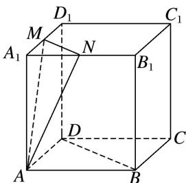

<!-- question-source:start -->
6. 如图, 在棱长为 1 的正方体 $ABCD - A_{1}B_{1}C_{1}D_{1}$ 中, $M$ , $N$ 分别是 $A_{1}D_{1}$ , $A_{1}B_{1}$ 的中点, 过直线 $BD$ 的平面 $\alpha //$ 平面 $AMN$ , 则平面 $\alpha$ 截该正方体所得截面的面积为( )

A. $\sqrt{2}$ B. $\frac{9}{8}$ C. $\sqrt{3}$ D. $\frac{\sqrt{6}}{2}$
<!-- question-source:end -->

![[高中/总复习/专题/立体几何/专题05 立体几何中的截面问题-立体几何（文理通用）/专题05_立体几何中的截面问题/对点训练/answers/Q00039579A1.md]]
