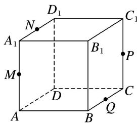

<!-- question-source:start -->
9. 如图, 在正方体 $ABCD - A_1B_1C_1D_1$ 中, $M, N, P, Q$ 分别是 $AA_1, A_1D_1, CC_1, BC$ 的中点, 给出以下四个结论: ① $A_1C \perp MN$ ; ② $A_1C //$ 平面 $MNPQ$ ; ③ $A_1C$ 与 $PM$ 相交; ④ $NC$ 与 $PM$ 异面. 其中不正确的结论是( )

A. ① B. ② C. ③ D. ④
<!-- question-source:end -->

![[高中/总复习/专题/立体几何/专题05 立体几何中的截面问题-立体几何（文理通用）/专题05_立体几何中的截面问题/对点训练/answers/Q00039582A1.md]]
