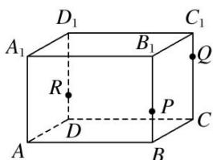

<!-- question-source:start -->
2. $P, Q, R$ 三点分别在直四棱柱 $AC_{1}$ 的棱 $BB_{1}, CC_{1}$ 和 $DD_{1}$ 上，则过 $P, Q, R$ 三点的截面的图形为( )

A. 四边形 B. 三角形 C. 五边形 D. 六边形
<!-- question-source:end -->

![[高中/总复习/专题/立体几何/专题05 立体几何中的截面问题-立体几何（文理通用）/专题05_立体几何中的截面问题/对点训练/answers/Q00043532A1.md]]
