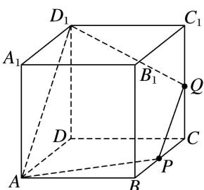
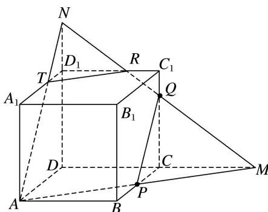

> [!faq]- 《专题05 立体几何中的截面问题-立体几何（文理通用）》例题解析
>
> > [!success]- **【答案】** ABC
>
> > [!note]- **【分析】**
> > 本题未单列分析。
>
> > [!note]- **【解析】**
> > 答案 ABC 解析 当 Q 为中点，即 $CQ=\frac{1}{2}$ 时，截面 $APQD_{1}$ 为等腰梯形，故 B 正确；
> > 
> > 当 $0 < CQ < \frac{1}{2}$ 时，只需在 $DD_{1}$ 上取点 M 使 $PQ \parallel AM$ ，即可得截面 APQM 为四边形，故 A 正确；当 $CQ = \frac{3}{4}$ 时，如图，延长 AP 交 DC 于 M，连接 MQ，并延长交 $C_{1}D_{1}$ 于 R，交 $DD_{1}$ 于 N，
> > 
> > $\because C Q = \frac{3}{4}, \therefore D N = \frac{3}{4} \times 2 = \frac{3}{2}, \therefore D _{1} N = \frac{1}{2}, \therefore \frac{D _{1} N}{D N} = \frac{1}{3}, \therefore \frac{D _{1} R}{D M} = \frac{1}{3}, \therefore D _{1} R = \frac{1}{3} D M = \frac{2}{3}, \therefore C _{1} R = \frac{1}{3}$ , 故 $C$ 正
> > 确；当 $\frac{3}{4} < CQ < 1$ 时，在上图中只需将 $Q$ 上移，此时截面形状仍是APQRT，为五边形，故D不正确.
