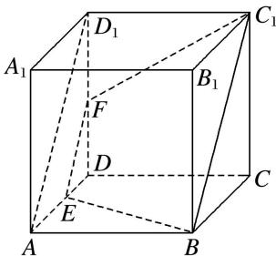

> [!faq]- 《专题05 立体几何中的截面问题-立体几何（文理通用）》例题解析
>
> > [!success]- **【答案】** B
>
> > [!note]- **【解析】**
> > 答案 A 解析 ∵ 正方体 $ABCD-A_{1}B_{1}C_{1}D_{1}$ 中，E，F 分别是棱 AD， $DD_{1}$ 的中点，
> >
> > 
> >
> > $\therefore EF \parallel AD_{1} \parallel BC_{1}$ . $\because EF \notin$ 平面 $BCC_{1}B_{1}$ , $BC_{1} \subset$ 平面 $BCC_{1}B_{1}$ , $\therefore EF \parallel$ 平面 $BCC_{1}B_{1}$ . 由正方体的棱长为 4, 可得截面是以 $BE = C_{1}F = 2\sqrt{5}$ 为腰, $EF = 2\sqrt{2}$ 为上底, $BC_{1} = 2EF = 4\sqrt{2}$ 为下底的等腰梯形, 故周长为 $6\sqrt{2} + 4\sqrt{5}$ .
