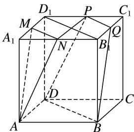

> [!faq]- 《专题05 立体几何中的截面问题-立体几何（文理通用）》例题解析
>
> > [!success]- **【答案】** B
>
> > [!note]- **【分析】**
> > 本题未单列分析。
>
> > [!note]- **【解析】**
> > 答案 B 解析 如图，分别取 $C_{1}D_{1}$ ， $B_{1}C_{1}$ 的中点 P，Q，连接 PQ， $B_{1}D_{1}$ ，DP，BQ，NP，易知 MN // $B_{1}D_{1}$
> > // BD, AD // NP, AD = NP, 所以四边形 ANPD 为平行四边形, 所以 AN // DP. 又 BD 和 DP 为平面 DBQP 内的两条相交直线, AN, MN 为平面 AMN 内的两条相交直线, 所以平面 DBQP // 平面 AMN, 四边形
> > DBQP 的面积即所求．因为 $PQ \parallel DB$ ，所以四边形 DBQP 为梯形， $PQ = \frac{1}{2} BD = \frac{\sqrt{2}}{2}$ ，梯形的高 $h = \sqrt{1^{2} + \left(\frac{1}{2}\right)^{2} - \left(\frac{\sqrt{2}}{4}\right)^{2}} = \frac{3\sqrt{2}}{4}$ ，所以四边形 DBQP 的面积为 $\frac{1}{2}(PQ + BD)h = \frac{9}{8}$ .
> > 
