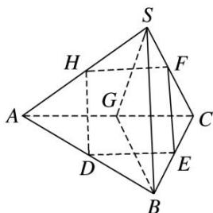

> [!faq]- 《专题05 立体几何中的截面问题-立体几何（文理通用）》例题解析
>
> > [!success]- **【答案】** 详见解析
>
> > [!note]- **【解析】**
> > 答案 $\frac{45}{2}$ 解析 如图，取 $AC$ 的中点 $G$ ，连接 $SG, BG$ . 易知 $SG \perp AC, BG \perp AC, SG \cap BG = G, SG, BG \subset$ 平面 $SGB$ ，故 $AC \perp$ 平面 $SGB$ ，所以 $AC \perp SB$ . 因为 $SB //$ 平面 $DEFH, SB \subset$ 平面 $SAB$ ，平面 $SAB \cap$ 平面 $DEFH = HD$ ，则 $SB // HD$ . 同理 $SB // FE$ . 又 $D, E$ 分别为 $AB, BC$ 的中点，则 $H, F$ 也为 $AS, SC$ 的中点，从而得 $HF \cong \frac{1}{2} AC \cong DE$ ，所以四边形 $DEFH$ 为平行四边形. 又 $AC \perp SB, SB // HD, DE // AC$ ，所以 $DE \perp HD$ ，所以四边形 $DEFH$ 为矩形，其面积 $S = HF \cdot HD = \left(\frac{1}{2} AC\right) \cdot \left(\frac{1}{2} SB\right) = \frac{45}{2}$ .
> >
> > 
