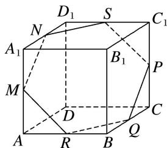

> [!faq]- 《专题05 立体几何中的截面问题-立体几何（文理通用）》例题解析
>
> > [!success]- **【答案】** B
>
> > [!note]- **【解析】**
> > 答案 B 解析 作出过 M, N, P, Q 四点的截面交 $C_{1}D_{1}$ 于点 S，交 AB 于点 R，如图中的六边形 MNSPQR，显然点 $A_{1}$ ，C 分别位于这个平面的两侧，故 $A_{1}C$ 与平面 MNPQ 一定相交，不可能平行，故结论②不正确.
> >
> > 
