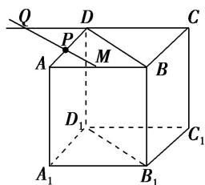

> [!faq]- 《专题05 立体几何中的截面问题-立体几何（文理通用）》例题解析
>
> > [!success]- **【答案】** 详见解析
>
> > [!note]- **【解析】**
> > 答案 $\frac{2\sqrt{2}}{3} a$ 解析 $\because$ 平面 $A_{1}B_{1}C_{1}D_{1} //$ 平面 $ABCD$ ，而平面 $B_{1}D_{1}P \cap$ 平面 $ABCD = PQ$ ，平面 $B_{1}D_{1}P \cap$ 平面 $A_{1}B_{1}C_{1}D_{1} = B_{1}D_{1}$ ， $\therefore B_{1}D_{1} // PQ$ .
> >
> > 
> >
> > 又∵ $B_{1}D_{1}$ // BD，∴BD//PQ，设 $PQ \cap AB = M$ ，∵AB//CD，∴△APM∽△DPQ。∴ $\frac{PM}{PQ} = \frac{AP}{PD} = \frac{1}{2}$ ，即 PQ =
> >
> > 2PM. 又知 $\triangle APM \sim \triangle ADB$ , $\therefore \frac{PM}{BD} = \frac{AP}{AD} = \frac{1}{3}$ , $\therefore PM = \frac{1}{3} BD$ , 又 $BD = \sqrt{2} a$ , $\therefore PQ = \frac{2\sqrt{2}}{3} a$ .
