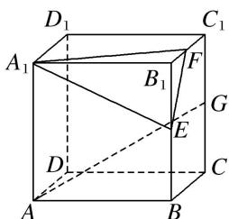

> [!faq]- 《专题05 立体几何中的截面问题-立体几何（文理通用）》例题解析
>
> > [!success]- **【答案】** A
>
> > [!note]- **【分析】**
> > 本题未单列分析。
>
> > [!note]- **【解析】**
> > 答案 C 解析 作法: ①在底面 $AC$ 内, 过 $E$ , $F$ 作直线 $EF$ , 分别与 $DA$ , $DC$ 的延长线交于 $L$ , $M$ . ②在侧面 $A_{1}D$ 内, 连接 $LG$ 交 $AA_{1}$ 于 $K$ . ③在侧面 $D_{1}C$ 内, 连接 $GM$ 交 $CC_{1}$ 于 $H$ . ④连接 $KE$ , $FH$ . 则五边形 $EFHGK$ 即为所求的截面.
> > 
> > (2)如图，在正方体 $ABCD - A_{1}B_{1}C_{1}D_{1}$ 中，点 $E$ ， $F$ 分别是棱 $B_{1}B$ ， $B_{1}C_{1}$ 的中点，点 $G$ 是棱 $C_1C$ 的中点，则过线段 $AG$ 且平行于平面 $A_{1}EF$ 的截面图形为（）
> > 
> > A. 矩形 B. 三角形 C. 正方形 D. 等腰梯形
> > 答案 D 解析 取 BC 的中点 H，连接 AH，GH， $AD_{1}$ ， $D_{1}G$ ，
> > 
> > 由题意得 $GH \parallel EF$ , $AH \parallel A_1F$ , 又 $GH \nsubseteq$ 平面 $A_1EF$ , $EF \subset$ 平面 $A_1EF$ , $\therefore GH \parallel$ 平面 $A_1EF$ , 同理 $AH \parallel$ 平面 $A_1EF$ , 又 $GH \cap AH = H$ , $GH$ , $AH \subset$ 平面 $AHGD_1$ , $\therefore$ 平面 $AHGD_1 \parallel$ 平面 $A_1EF$ , 故过线段 $AG$ 且与平面 $A_1EF$ 平行的截面图形为四边形 $AHGD_1$ , 显然为等腰梯形.
> > (3)(2018·全国Ⅰ)已知正方体的棱长为1，每条棱所在直线与平面α所成的角都相等，则α截此正方体所得截面面积的最大值为( )
> > A. $\frac{3\sqrt{3}}{4}$ B. $\frac{2\sqrt{3}}{3}$ C. $\frac{3\sqrt{2}}{4}$ D. $\frac{\sqrt{3}}{2}$
> > 答案 A 解析 如图所示，在正方体 $ABCD-A_{1}B_{1}C_{1}D_{1}$ 中，平面 $AB_{1}D_{1}$ 与棱 $A_{1}A, A_{1}B_{1}, A_{1}D_{1}$ 所成的角都相等，又正方体的其余棱都分别与 $A_{1}A, A_{1}B_{1}, A_{1}D_{1}$ 平行，故正方体 $ABCD-A_{1}B_{1}C_{1}D_{1}$ 的每条棱所在直线与平面 $AB_{1}D_{1}$ 所成的角都相等．取棱 AB, $BB_{1}, B_{1}C_{1}, C_{1}D_{1}, DD_{1}, AD$ 的中点 E, F, G, H, M, N，则正六边形 EFGHMN 所在平面与平面 $AB_{1}D_{1}$ 平行且面积最大，此截面面积为 $S_{正六边形 EFGHMN}=6\times\frac{1}{2}\times\frac{\sqrt{2}}{2}\times\frac{\sqrt{2}}{2}\sin60^{\circ}=\frac{3\sqrt{3}}{4}$ . 故选 A.
> > 
> > (4)如图, 在三棱锥 $O-ABC$ 中, 三条棱 $OA$ , $OB$ , $OC$ 两两垂直, 且 $OA>OB>OC$ , 分别经过三条棱 $OA$ , $OB$ , $OC$ 作一个截面平分三棱锥的体积, 截面面积依次为 $S_1$ , $S_2$ , $S_3$ , 则 $S_1$ , $S_2$ , $S_3$ 的大小关系为 \_\_\_\_.
> > 
> > 答案 $S_{3} < S_{2} < S_{1}$ 解析 由题意知 $OA, OB, OC$ 两两垂直，可将其放置在以 $O$ 为顶点的长方体中，设三边 $OA, OB, OC$ 分别为 $a, b, c$ ，且 $a > b > c$ ，利用等体积法易得
> > 
> > $$
> > S _ {1} = \frac {1}{4} a \sqrt {b ^ {2} + c ^ {2}}, S _ {2} = \frac {1}{4} b \sqrt {a ^ {2} + c ^ {2}}, S _ {3} = \frac {1}{4} c \sqrt {a ^ {2} + b ^ {2}}, \therefore S _ {1} ^ {2} - S _ {2} ^ {2} = \frac {1}{1 6} (a ^ {2} b ^ {2} + a ^ {2} c ^ {2}) - \frac {1}{1 6} (b ^ {2} a ^ {2} + b ^ {2} c ^ {2}) = \frac {1}{1 6} c ^ {2} (a ^ {2} -
> > $$
> > $b^{2}$ ，又 a > b，∴ $S_{1}^{2} - S_{2}^{2} > 0$ ，即 $S_{1} > S_{2}$ ，同理，平方后作差可得， $S_{2} > S_{3}$ ，∴ $S_{3} < S_{2} < S_{1}$ .
> > (5)(2016·全国Ⅰ)平面α过正方体 $ABCD-A_{1}B_{1}C_{1}D_{1}$ 的顶点 A，α// 平面 $CB_{1}D_{1}$ ，α∩ 平面 ABCD=m，α∩ 平面 $ABB_{1}A_{1}=n$ ，则 m，n 所成角的正弦值为( )
> > A. $\frac{\sqrt{3}}{2}$ B. $\frac{\sqrt{2}}{2}$ C. $\frac{\sqrt{3}}{3}$ D. $\frac{1}{3}$
> > 答案 A 解析 如图所示，设平面 $CB_{1}D_{1} \cap$ 平面 ABCD = m₁，∵ $\alpha \parallel$ 平面 $CB_{1}D_{1}$ ，则 $m_{1} \parallel m$ ，
> > 
> > 又∵平面 $ABCD \parallel$ 平面 $A_{1}B_{1}C_{1}D_{1}$ ，平面 $CB_{1}D_{1} \cap$ 平面 $A_{1}B_{1}C_{1}D_{1} = B_{1}D_{1}$ ，∴ $B_{1}D_{1} \parallel m_{1}$ ，∴ $B_{1}D_{1} \parallel m$ ，同理可得 $CD_{1} \parallel n$ 。故 m，n 所成角的大小与 $B_{1}D_{1}$ ， $CD_{1}$ 所成角的大小相等，即 $\angle CD_{1}B_{1}$ 的大小。而 $B_{1}C = B_{1}D_{1} = CD_{1}$ （均为面对角线），因此 $\angle CD_{1}B_{1} = \frac{\pi}{3}$ ，得 $\sin \angle CD_{1}B_{1} = \frac{\sqrt{3}}{2}$ ，故选 A。
> > 【对点精练】
