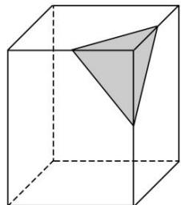

<!-- question-source:start -->
4. 如图，将一个长方体用过相邻三条棱的中点的平面截出一个棱锥，则该棱锥的体积与剩下的几何体体

积的比为\_\_\_\_。

<!-- question-source:end -->

![[高中/总复习/专题/立体几何/专题05 立体几何中的截面问题-立体几何（文理通用）/专题05_立体几何中的截面问题_立体几何_文理通用_/对点训练/answers/Q00039577A1.md]]
