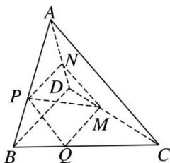

<!-- question-source:start -->
8. 在四面体 $ABCD$ 中, 截面 $PQMN$ 是正方形, 则在下列结论中, 错误的是( )

A. $AC \perp BD$ B. $AC \parallel$ 截面 $PQMN$ C. $AC = BD$ D. 异面直线 $PM$ 与 $BD$ 所成的角为 $45^{\circ}$
<!-- question-source:end -->

![[高中/总复习/专题/立体几何/专题05 立体几何中的截面问题-立体几何（文理通用）/专题05_立体几何中的截面问题_立体几何_文理通用_/对点训练/answers/Q00039581A1.md]]
