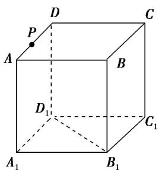

<!-- question-source:start -->
10. 如图所示, 正方体 $ABCD - A_{1}B_{1}C_{1}D_{1}$ 的棱长为 $a$ , 点 $P$ 是棱 $AD$ 上一点, 且 $AP = \frac{a}{3}$ , 过 $B_{1} 、 D_{1} , P$ 的平面交底面 $ABCD$ 于 $PQ$ , $Q$ 在直线 $CD$ 上, 则 $PQ = \_$ .

<!-- question-source:end -->

![[高中/总复习/专题/立体几何/专题05 立体几何中的截面问题-立体几何（文理通用）/专题05_立体几何中的截面问题_立体几何_文理通用_/对点训练/answers/Q00039583A1.md]]
