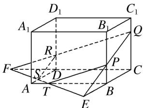

> [!faq]- 《专题05 立体几何中的截面问题-立体几何（文理通用）》例题解析
>
> > [!success]- **【答案】** C
>
> > [!note]- **【分析】**
> > 本题未单列分析。
>
> > [!note]- **【解析】**
> > 答案 C 解析 作法: (1) 连接 $QP$ , $QR$ 并延长, 分别交 $CB$ , $CD$ 的延长线于 $E$ , $F$ . (2) 连接 $EF$ 交 $AB$ 于 $T$ , 交 $AD$ 于 $S$ . (3) 连接 $RS$ , $TP$ . 则五边形 $PQRST$ 即为所求截面.
> > 
